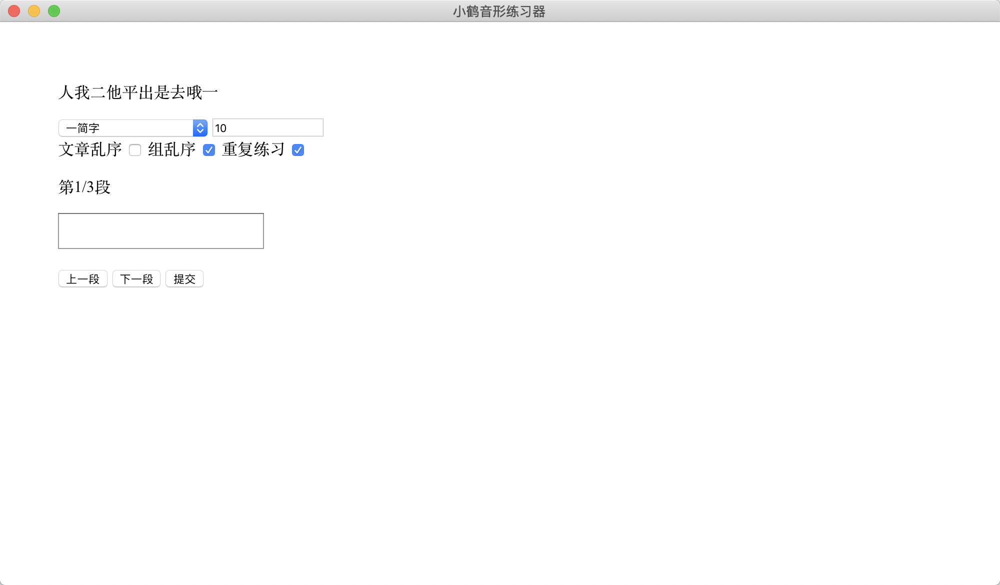

# 小鹤音形Mac练习

> 基于 electron-vue 开发



> 输入框中修改完成后，皆可回车刷新或提交

#### Build Setup

``` bash
# install dependencies
yarn

# serve with hot reload at localhost:9080
yarn run dev

# build electron application for production
yarn run build


# lint all JS/Vue component files in `src/`
yarn run lint

```

---

This project was generated with [electron-vue](https://github.com/SimulatedGREG/electron-vue)@[45a3e22](https://github.com/SimulatedGREG/electron-vue/tree/45a3e224e7bb8fc71909021ccfdcfec0f461f634) using [vue-cli](https://github.com/vuejs/vue-cli). Documentation about the original structure can be found [here](https://simulatedgreg.gitbooks.io/electron-vue/content/index.html).
